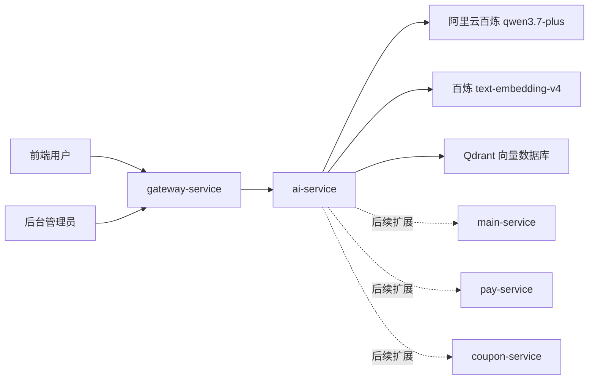

# 好课学堂AI客服产品设计书

## 1. 背景

好课学堂已经具备课程、用户、优惠券、订单、支付、退款、评论、学习进度等核心功能。随着功能增多，用户会产生大量重复问题，例如“优惠券怎么用”“支付后为什么还没开通课程”“退款后课程还能看吗”。这些问题适合先由 AI 客服处理，复杂问题再转人工或引导用户联系管理员。

## 2. 产品定位

AI 客服是一个独立微服务，负责回答好课学堂相关问题。第一版重点做知识库问答，不直接修改订单、退款、优惠券等业务数据。

经验建议：智能体项目第一版不要急着给 AI “操作系统”的权限。先让它能基于可靠资料回答问题，再逐步接入业务查询和业务动作。

## 3. 用户角色

- C 端用户：咨询课程、学习、订单、支付、退款、优惠券等问题。
- 管理员：维护客服知识库，后续查看会话记录和命中情况。

## 4. MVP 范围

第一版只做三件事：

- 管理端录入知识：把文本切分后写入向量数据库。
- 客户端提问：根据问题检索知识库，调用大模型生成回答。
- 返回引用片段：让前端或管理员知道 AI 回答参考了哪些资料。

暂时不做：

- AI 直接退款、取消订单、发券。
- 多轮长期记忆。
- 人工客服工单流转。
- 复杂知识库版本管理。

## 5. 架构设计



## 6. 第一版接口

### 6.1 管理端知识入库

`POST /api/ai/admin/knowledge/ingest`

```json
{
  "title": "退款规则",
  "source": "产品设计书",
  "content": "用户支付成功后可以申请退款，退款成功后课程权益会被回收。"
}
```

### 6.2 客户端 AI 客服提问

`POST /api/ai/client/chat`

```json
{
  "conversationId": "",
  "question": "退款后我还能继续看课程吗？",
  "topK": 5
}
```

## 7. 技术选型

- Spring Boot：沿用现有后端技术栈。
- LangChain4j：负责模型、向量模型、向量库的统一接入。
- 阿里云百炼 OpenAI 兼容协议：第一版接入 `qwen3.7-plus`，后续也方便切换其他模型。
- Qdrant：轻量、部署简单，适合当前学习项目。

## 8. 后续迭代

- 增加 AI 会话记录表。
- 增加知识库原文表，MySQL 存原文，Qdrant 存向量索引。
- 接入 main-service 查询订单、课程、优惠券等实时数据。
- 增加“无法回答”兜底策略和转人工入口。
- 增加敏感操作白名单，避免 AI 直接执行退款、发券等动作。
